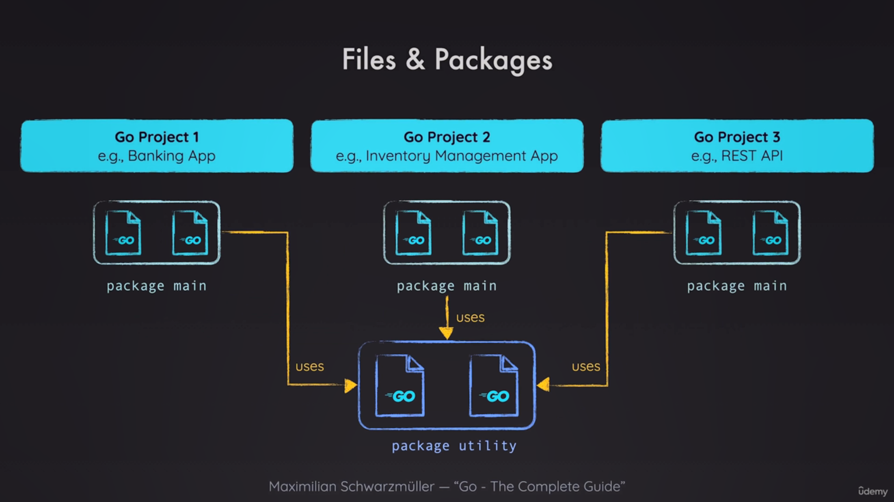

**all images is ordered so feelfree and open it wen ponted at in this readme**

# first go program

```go
package main
import (
	"fmt"
)
func main(){
    fmt.Print("wp")
}
```

Print is a function for a specific command and used for print someting in terminal
for string in commen we use double-qoute and if for some ression(we need double-qoute in our string) we use backtick (``).

# package

the important thing in go is package witout specify package you get an error and cant run your programm


# why we use main as package name

The main package in Go is used for a specific purpose:

1. It indicates that this is an executable program, not a library.
2. It's the entry point of the application.
3. The main function within the main package is where the program execution begins.

# run go witout ponit to specific file(build .exe and ... file)

in go application we can run our program like this

```bash
go build
```

but your may get an error like this

```bash
cannot find main module ....
to create a module there, run:
go mod init
```

so you use

```bash
go mod init <a_path>
```

```bash
go mod init example.com/newGoApp
```

after run above command you got the information

```bash
go: creating new go.mod: module example.com/newGoApp
go: to add module requirements and sums:
        go mod tidy
```

A go.mod file is a key component of Go's module system, introduced in Go 1.11. It serves several important purposes:

1. Module declaration: It declares the module path at the top of the file.

2. Dependency management: It lists all the direct and indirect dependencies of your project, along with their versions.

3. Version control: It helps in versioning your own module and managing versions of dependencies.

4. Reproducible builds: It ensures that your project can be built consistently across different environments.

5. Go version: It specifies the minimum version of Go required for the module.

The go.mod file is typically located in the root directory of your project. When you run commands like go get, go build, or go test, Go uses the information in go.mod to manage dependencies and build your project.

go.mod file example:

```
module example.com/newGoApp

go 1.23.0

require (
    github.com/somepackage v1.2.3
    github.com/anotherpackage v2.3.4
)
```

after run this command you can build your project and get a .exe file(in linux and maacos you get a exutable file and can run it with path of your app like ./newGoApp and your program will be run in your os))

```bash
go build
```

notice: if your application dosent have main package with go build you didnet get file because you dont have entry for what is your bigining point of your app

# main function

you need main function to tell go where you should start executing the application unlike other languages like javascript that thay start executing the application from the first line of the file. in go you need to tell the application where is main function and where should start executing the application.

notice: in go in main package you can't have more than one main function. so you can't have a main function in index.go and feature.go

notice: if you wanna create a liberary you dont need a main function. because you import your method on other file.
