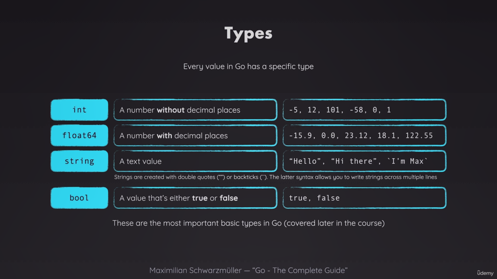

this doc is sperate part for good interaction with investment_calculator.go file so can see the comment in investment_calculator.go file like section1 and section2 and ... for each section in investment_calculator.go file put out code from comment and use them.

# section1

## naming

in go we use underline for seperate word but you can use dash(underline is better) for module name in go.mod you should act like url so you need this [doc](https://restfulapi.net/resource-naming/)

## miss match type

in go you can't do opration between two different type like this

```go
var investmentAmount = 1000
var expectReturnRate = 5.5
var year = 10
var futureValue =investmentAmount * (1+expectReturnRate/100) // error: miss match type int and float
```

as you can see you can not do that. so you need to convert type of variable to another type by float64(varible name)

```go
float64(investmentAmount) * (1+expectReturnRate/100)
```

notice: you learn how to create varible by var keyword and for naming in go we use camleCase

notice: this formula for calculator investment is not complite the complited is:

```go
package main

import "math"

func main() {
	var investmentAmount = 1000
	var expectReturnRate = 5.5
	var year = 10
	var futureValue = float64(investmentAmount) * math.Pow(1+expectReturnRate/100, float64(year))
}
```

**as you can see we use math.Pow for calculate power of number.its imported by math package.**

## multiply import

for import more than one package you can do like this

```go
import (
    "math"
    "fmt"
)
```

aftter that you now you can print your calcculate result by this fmt package:

```go
fmt.Println(futureValue)
```

notice: we use Println for print something in terminal with new line after print your result.

# section2

## explicit type assignment

you can do this and go deal with number you assine to and converted to that type you mention if go can and if not go will give you error.

```go
var investmentAmount float64 = 1000 // 1000.0
```

notice: here is some basic type in go:


## store varible

if you have multiple varible

```go
var investmentAmount,year,text = 1000,10,"hi"
```

if you have multiple varible that have same type you can do like this

```go
var investmentAmount,year float64= 1000,10
var num1,num2 int , text string = 1000,10,"hi" // error you cant do like this

var num1,num2 int = 1000,10
var  text string = "gg"
```

if you dont wanna specify type of varible you can do like this

```go
investmentAmount,year := 1000,10
```

notice: this is a short assignment statement. and is a convention to use this in go as can as possible(please careful for readability). so if you have a varible that get type from assinment use this.
better exmple:

```go
futureValue := investmentAmount * math.Pow(1+expectReturnRate/100, year)
```

as maby you know some time we sotre a value that never change. in go we use const keyword for this.

```go
const inflationRate = 2.5
futureReelValue := futureValue / math.Pow(1+inflationRate/100, year)
```

so whats the difference between var and const? let me do that by example:

```go
var investmentAmount float64= 1000
const inflationRate = 2.5
fmt.Scan(&investmentAmount)
fmt.Scan(&inflationRate) // error can not reassine const varible
```

notice: fmt.Scan is a function that read from terminal. and & is a pointer. you can't do like:

```go
fmt.Scan(investmentAmount)
```

but why?

he reason you can't use **fmt.Scan(investmentAmount)** directly is because **fmt.Scan** requires pointers to the variables where it will store the scanned values.

When you use **fmt.Scan**, you're asking it to read input from the terminal and store that input in a variable. To do this, **fmt.Scan** needs to know where in memory to put that value. That's why it expects pointers.

Here, **&investmentAmount** gives the memory address of **investmentAmount**. This allows **fmt.Scan** to directly modify the value at that memory location with the input it receives.

If you tried to use **fmt.Scan(investmentAmount)**, you'd be passing the value of **investmentAmount**, not its memory address and **fmt.Scan()** dont need value actully this method give us a value. The function wouldn't know where to store the input, and your program wouldn't work as intended.

## Printf

you can use Printf for print something in terminal with format.

```go
fmt.Printf("investmentAmount: %v, year: %v, futureValue: %v, futureReelValue: %v", investmentAmount, year, futureValue, futureReelValue)
```

as you can see we use %v for print value of varible(act like a placeholder). for more information about Printf you can see [here](https://pkg.go.dev/fmt#hdr-Printing)

## Sprintf

sometimes you need to store your print in a varible not printing in terminal. for this you can use Sprintf.

```go
var result = fmt.Sprintf("investmentAmount: %v, year: %v, futureValue: %v, futureReelValue: %v", investmentAmount, year, futureValue, futureReelValue)
fmt.Println(result)
```

## function

1. Basic Function Syntax: Functions in Go are defined using the func keyword, followed by the function name, parameters, and return type:

```go
func functionName(parameter1 type, parameter2 type) returnType {
    // function body
    return value
}
```

2. Multiple Parameters: Functions can have multiple parameters of the same or different types:

```go
func add(x, y int) int {
    return x + y
}
```

3. Multiple Return Values: Go functions can return multiple values:

```go
func divide(x, y float64) (float64, error) {
    if y == 0 {
        return 0, errors.New("division by zero")
    }
    return x / y, nil
}
```

4. Named Return Values: You can name return values in the function signature:

```go
func rectangle(width, height float64) (area, perimeter float64) {
    area = width * height
    perimeter = 2 * (width + height)
    return // naked return
}
```

5. Anonymous Functions: Go supports anonymous functions that can be assigned to variables or passed as arguments:

```go
square := func(n int) int {
    return n * n
}
```

6. Closures: Functions can capture and access variables from their outer scope:

```go
func adder() func(int) int {
    sum := 0
    return func(x int) int {
        sum += x
        return sum
    }
}
```
