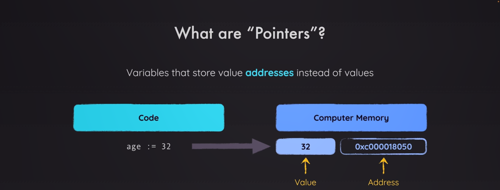
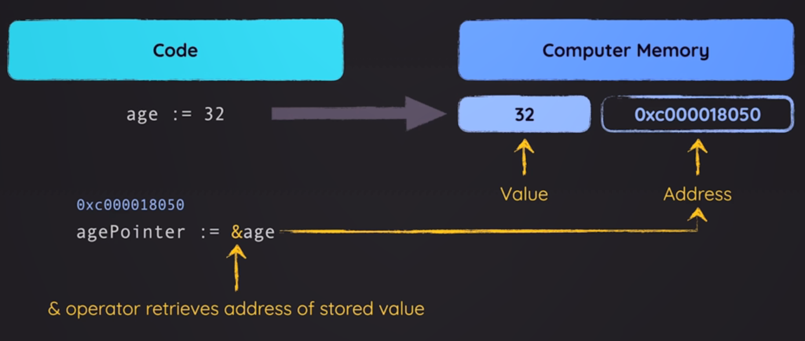
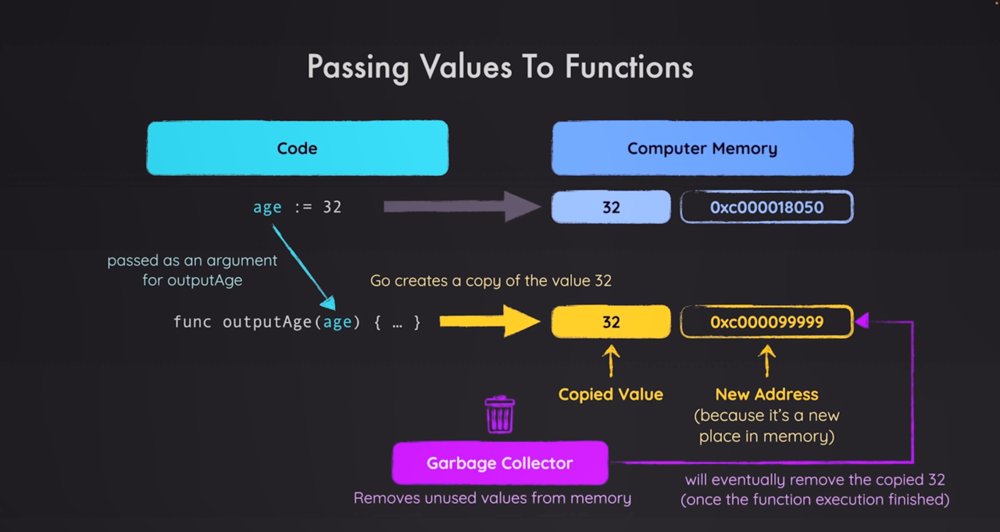
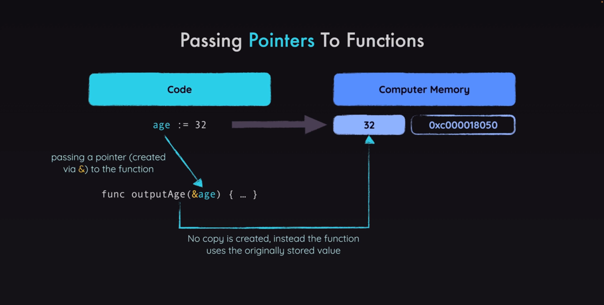

## pointers

varible that store value **adresses** instead of value

for example imagine you store a vlaue 32 to a varible and in that case that value 32 is stored in memory and that value in memory automaticly get address. every space in memore computer has address and that address is requierd to retrive that value and work with it



you can store value address with **&** opratior

```go
age := 32

agePointer := &age
```



### why pointers

2 main advantages is the awnser of this question

1. avoiding unnecesserily value copies
2. directly mutate value

avoiding unnecesserly value copies: by default, go create a copy when passing values to function



notice: for very large and complex values, this may take up too much memory space unnecesserily.
so with pointers, only one value is stored in memory(and the address is passed around)



directly mutate value:
pass a pointer (address) insted of a value to a function. the function can than directly edit the underlying value - no return value is required.


can lead to less code (but also to less understandable code or unexpected behaviors)

mabey you dont know why x become 15:


avoiding unnecesserily value copies simple example :

```go
age := 32
agePointer := &age
fmt.Println("age: ",agePointer) // age: 0xc00000a0c8
```

look at the type of agePointer: var agePointer **\*int**. this **\*int** is you deal with an address of a value that is an int

if you wanna get value from an pointer you can use **\*** for that

```go
fmt.Println("age: ",*agePointer) // age: 32
```

how to use pointer in func and make them give us the value:

```go
func main() {
	age := 32

	agePointer := &age

	fmt.Println("age: ", *agePointer) // age: 32

	adultYear := getAdultYear(agePointer)

	fmt.Println(adultYear) // 14
}

func getAdultYear(age *int) int {
	return *age - 18
}
```

### important

notice: the example above its just for showing you how to work with pointer and avoiding to copy but the **age** varible its so much small and its not huge for trying to optimize please relax and use this pointer feature wisly. you should not do that :) - Fardin Kamali

directly mutate value simple example:

```go
func main() {
	age := 32

	agePointer := &age

	fmt.Println("age: ", *agePointer)

	editAgeToAdultYear(agePointer)
	fmt.Println("after edit: ", age)
}

func editAgeToAdultYear(age *int) {
	*age = *age - 18
}
```

as you can see now age is updated with mutate from address directly so u use **\*age** to point to where age is store and you wanna access to the value not just address (**&age**) and **\*age - 18** access to value and -18
